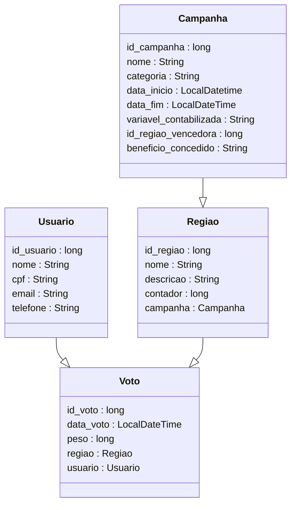

# 🌐 Suffra Backend Server  
API REST desenvolvida com Java Springboot para o aplicativo Suffra, desenvolvido como solução de gerenciamento de campanhas de conscientização relacionadas com energia sustentável.  
Link GitHub: https://github.com/eduardofuncao/suffra-backend  

## 👥 Equipe  
- Artur Lopes Fiorindo         53481  
- Eduardo Felipe Nunes Função  553362  
- Jhoe Yoshio Kochi Hashimoto  553831  

## 📖 Contextualização  
**Suffra** é um projeto que implementa uma competição gamificada para introdução de campanhas de conscientização para a população.  

### 📊 Compreendendo as entidades do sistema  
De forma genérica, para cada **campanha**, os **usuários** contribuirão por meio de **votos** para alguma **região**. Ao final do período de campanha, a região com maior quantidade de votos será determinada a vencedora, sendo contemplada com algum benefício.  

> REGIÃO  -> Torres de um condomínio  
> VOTO    -> Entradas de gastos energéticos por Torre  
> USUÁRIO -> Morador do condomínio  

### ⚡ Como será utilizado nessa Entrega
Especificamente, a proposta apresentada será uma campanha de conscientização sobre redução no consumo energético de torres de um condomínio residencial.  

Ao final do período da campanha, a torre com menores gastos energéticos será a vencedora, garantindo aos seus moradores um desconto na conta de condomínio.  

### 🚀 Extensões futuras  
Como o sistema foi idealizado para ser utilizado em outras categorias que não o consumo energético, seria possível adaptá-lo para campanhas como:  
- 💧 Redução do consumo de água  
- ♻️ Incentivo à reciclagem de lixo  
- 🤝 Doações para causas sociais relacionadas à energia sustentável  

---

## 🛠️ Modelagem do projeto  

### 📐 Diagrama de Classes  


### 🔗 Diagrama Entidade Relacionamento  
  

### ☁️ Diagrama de Infraestrutura em nuvem  
  


### 🔄 Fluxo HATEOAS  
Será implementado o seguinte fluxo HATEOAS, incluindo o caso de uso de inclusão de voto e encerramento de campanha:  
  

Caso um dos endpoints representados seja chamado, os links para a sequência do fluxo serão retornados na resposta.  

---

## 🧪 Testes  
Para testar o projeto, pode ser utilizada a **collection Postman** fornecida em `suffra-collection/`.  
- Inclui todos os endpoints disponíveis, com exemplos de request body.  
- O Swagger pode ser acessado em: `http://localhost:8080/swagger-ui/index.html`.  

**Ordem sugerida para criação das entidades no banco de dados**:  
Campanha → Região → Usuário → Voto  

## 🚀 Instruções para operacionalização da infra e build do código:

### 1. Configuração do Grupo de Recursos no Azure

Crie o grupo de recursos:
```bash
az group create --name rg-sufradev-prd --location eastus
```

### 2. Criação das VMs:
VM Backend (Linux):
```bash
az vm create \
  --resource-group rg-sufradev-prd \
  --name vm-sufradev-linux-back-prd \
  --image UbuntuLTS \
  --size Standard_DS2_v2 \
  --admin-username admsufra \
  --admin-password sufra123@2024 \
  --authentication-type password \
  --storage-sku Standard_LRS \
  --os-disk-size-gb 30 \
  --custom-data cloud-init.txt \
  --public-ip-sku Standard \
  --tags Environment=Production
```

VM Frontend (Windows Server):
```bash
az vm create \
  --resource-group rg-sufradev-prd \
  --name vm-sufradev-windowsserver-front-prd \
  --image MicrosoftWindowsServer:windows-server:2022-datacenter-azure-edition:latest \
  --size Standard_D2s_v5 \
  --admin-username adm-sufra \
  --admin-password sufra123@2024 \
  --public-ip-sku Standard \
  --os-disk-size-gb 128 \
  --authentication-type password
```

### 3. Configuração de Portas
```bash
az vm open-port --port 80-100 --resource-group rg-sufradev-prd --name vm-sufradev-windowsserver-front-prd
az vm open-port --port 8080 --resource-group rg-sufradev-prd --name vm-sufradev-linux-back-prd
az vm open-port --port 22 --resource-group rg-sufradev-prd --name vm-sufradev-linux-back-prd
az vm open-port --port 443 --resource-group rg-sufradev-prd --name vm-sufradev-linux-back-prd
```


### 4. 🛠 Configuração do Backend (Linux)
Java 17:
```bash
sudo apt update && sudo apt install openjdk-17-jdk -y
export JAVA_HOME=/usr/lib/jvm/java-17-openjdk-amd64 export PATH=$JAVA_HOME/bin:$PATH
java -version
```

Gradle:
```bash
sudo apt install gradle
gradle wrapper
chmod +x ./gradlew
./gradlew wrapper --gradle-version 8.0
./gradlew clean build
```

### 5. Clonar o Projeto
```bash
cd /home/admsufra
git clone https://github.com/eduardofuncao/suffra-backend.git
cd suffra-backend
```


### 6. Build e Execução:
```bash
cd /home/admsufra/sufrajava/suffra-backend
 ./gradlew clean build
./gradlew bootRun

cd /home/admsufra/sufrajava/suffra-backend/build/libs
java -jar build/libs/suffra-0.0.1-SNAPSHOT.jar
```

```bash
ssh admsufra@191.233.254.131
sufra123@2024
```

---

## ✅ TODO  
- 🎥 Link para vídeo demonstrativo (máximo de 10 minutos)
- Informações do deploy em nuvem
- 🛠️ Implementar endpoints para rodar procedures no banco de dados  
- ⚠️ Exceções para campanhas sem regiões associadas  

---

## 🎉 DONE  
- Endpoints para total de contadores por região ✅  
- Endpoint para encerrar campanha ✅  
- Exceções personalizadas ✅  
- Deploy em nuvem ✅  
- Collection do Postman ✅  
- Fluxo HATEOAS ✅  
- Diagramas (classes, entidade-relacionamento, infraestrutura) ✅
- 📚 Documentação ✅

