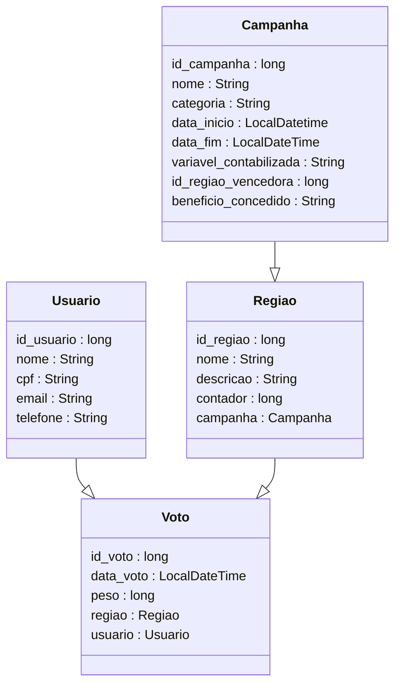

# Suffra Backend Server
API REST desenvolvida com Java Springboot para o aplicativo Suffra, 
desenvolvido como solução de gerenciamento de campanhas de concientização relacionadas com energial sustentável.
link Github: https://github.com/eduardofuncao/suffra-backend

## Equipe
- Artur Lopes Fiorindo         53481 
- Eduardo Felipe Nunes Função  553362 
- Jhoe Yoshio Kochi Hashimoto  553831

## Contextualização

## Modelagem do projeto

### Diagrama de Classes


### Diagrama Entidade Relacionamento

### Diagrama de Infraestrutura em nuvem

### Fluxo HATEOAS
Será implementado o seguinte fluxo HATEOAS, incluindo o caso de uso de inclusão de voto e encerramento de campanha:

Caso um dos endpoints representados seja chamado, os link para a sequência do fluxo serão retornados na resposta.

## Testes
Para testar o projeto, pode ser utilizada a collection postman fornecida em `suffra-collection/`. Ela contém todos os endpoints que podem ser chamados pela aplicação. 
Em endpoints POST e PUT, foram incluídos exemplos de request body com atributos que passam em todas as validações.

O Swagger também foi habilitado para a aplicação, sendo acessível em `http://localhost:8080/swagger-ui/index.html`

Devido às constraints nas tabelas, é indicado a criação das entidades na seguinte ordem: 
Campanha -> Regiao -> Usuario -> Voto

## TODO
- complementar com diagramas entidade relacionamento, diagrama de infra de rede
- documentação
  - texto explicativo do projeto, contextatualizando segundo a ótica da energia sustentável
  - Um arquivo ReadMe no Github, incluindo descrição do sistema desenvolvido, com imagens,
    textos explicativos e exemplos de testes (com exemplos JSON para CRUD via Postman).
- Link do Vídeo demonstrando o software funcionando (não é o vídeo do Pitch) com áudio e
  com duração máxima de 10 minutos (YouTube ou equivalente).
- endpoints para rodar procedures db
- exceção para caso em que usuário tenta encerrar uma campanha sem regiões associadas

## DONE
- implementar endpoints para pegar total de contadores de regioes (geral e individual) OK
- implementar endpoint para encerrar campanha OK
- exceções personalizadas OK
- deploy em nuvem OK
- collection do postman OK
- fluxo hateoas OK
- diagrama de classes OK


# 🌱 SUFFRADEV - Sistema de Consumo Consciente de Energia

## 📖 Sobre o Projeto
O **SUFFRADEV** é um sistema desenvolvido para promover a conscientização sobre o uso sustentável de energia em condomínios. Ele permite que os moradores participem de uma competição saudável para avaliar qual torre consome menos energia (kWh). Ao final de cada período de avaliação, a torre vencedora recebe um desconto na fatura do condomínio, incentivando o uso consciente de energia.

Além de contribuir para a redução de custos, o sistema busca promover uma reflexão sobre o impacto ambiental do consumo energético, incentivando a transição para soluções mais sustentáveis e responsáveis.

---

## ✨ Funcionalidades
- **💾 Registro de Dados**: Interface para entrada de dados de consumo energético por torre.
- **📊 Dashboard Interativo**: Visualização em tempo real do desempenho das torres.
- **🏆 Fechamento de Período**: Avaliação automática e identificação da torre vencedora.
- **📉 Relatórios**: Emissão de relatórios detalhados sobre o consumo e economia gerada.
- **🎯 Campanhas Personalizadas**: Adaptável para outras iniciativas de sustentabilidade.

---

## 🛠️ Tecnologias Utilizadas
- **Frontend**: React.js
- **Backend**: Java 17 com Spring Boot
- **Banco de Dados**: Oracle
- **Visualização de Dados**: Chart.js para gráficos interativos
- **Hospedagem**: Azure

---

## ⚙️ Requisitos para Execução
- Node.js (para o frontend, versão 16 ou superior)
- Java 17 (para o backend)
- Gradle 8.0 ou superior
- Conta no Azure (para hospedagem e testes)

---

## 🚀 Instruções de Instalação

### 1. Configuração do Grupo de Recursos no Azure

Crie o grupo de recursos:
```bash
az group create --name rg-sufradev-prd --location eastus
````

### 2. Criação das VMs:

VM Backend (Linux):
```bash
az vm create \
  --resource-group rg-sufradev-prd \
  --name vm-sufradev-linux-back-prd \
  --image UbuntuLTS \
  --size Standard_DS2_v2 \
  --admin-username admsufra \
  --admin-password sufra123@2024 \
  --authentication-type password \
  --storage-sku Standard_LRS \
  --os-disk-size-gb 30 \
  --custom-data cloud-init.txt \
  --public-ip-sku Standard \
  --tags Environment=Production

```
VM Frontend (Windows Server):
```bash
az vm create \
  --resource-group rg-sufradev-prd \
  --name vm-sufradev-windowsserver-front-prd \
  --image MicrosoftWindowsServer:windows-server:2022-datacenter-azure-edition:latest \
  --size Standard_D2s_v5 \
  --admin-username adm-sufra \
  --admin-password sufra123@2024 \
  --public-ip-sku Standard \
  --os-disk-size-gb 128 \
  --authentication-type password
```
### 3. Configuração de Portas

```bash
az vm open-port --port 80-100 --resource-group rg-sufradev-prd --name vm-sufradev-windowsserver-front-prd
az vm open-port --port 8080 --resource-group rg-sufradev-prd --name vm-sufradev-linux-back-prd
az vm open-port --port 22 --resource-group rg-sufradev-prd --name vm-sufradev-linux-back-prd
az vm open-port --port 443 --resource-group rg-sufradev-prd --name vm-sufradev-linux-back-prd

```

### 4. 🛠️ Configuração do Backend (Linux)

Java 17:

``` bash
sudo apt update && sudo apt install openjdk-17-jdk -y
java -version
```

Gradle:

```bash

sudo apt install gradle
```

### 5. Clonar o Projeto

```bash

cd /home/admsufra
git clone https://github.com/eduardofuncao/suffra-backend.git
cd suffra-backend

```

### 6. Build e Execução:

``` bash
cd /home/admsufra/sufrajava/suffra-backend
 ./gradlew clean build

cd /home/admsufra/sufrajava/suffra-backend/build/libs
java -jar build/libs/suffra-0.0.1-SNAPSHOT.jar

```

🤝 Equipe de Desenvolvimento
Artur Lopes - RM553481
Eduardo Função - RM553362
Jhoe Hashimoto - RM553831


Feito com ⚡ para um futuro mais sustentável! 🌎
