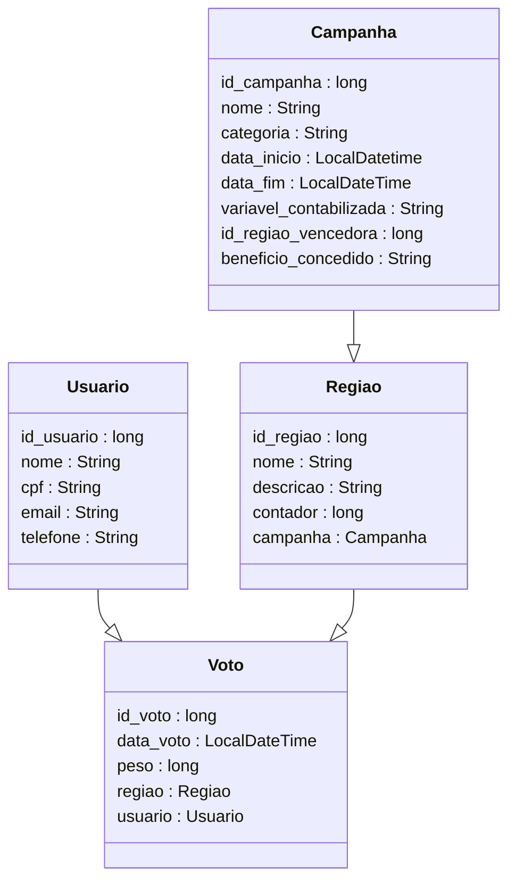

# Suffra Backend Server
API REST desenvolvida com Java Springboot para o aplicativo Suffra, 
desenvolvido como solução de gerenciamento de campanhas de concientização relacionadas com energial sustentável.
link Github: https://github.com/eduardofuncao/suffra-backend

## Equipe
- Artur Lopes Fiorindo         53481 
- Eduardo Felipe Nunes Função  553362 
- Jhoe Yoshio Kochi Hashimoto  553831

## Contextualização

## Modelagem do projeto

### Diagrama de Classes

### Diagrama Entidade Relacionamento

### Diagrama de Infraestrutura em nuvem

### Fluxo HATEOAS
Será implementado o seguinte fluxo HATEOAS, incluindo o caso de uso de inclusão de voto e encerramento de campanha:

Caso um dos endpoints representados seja chamado, os link para a sequência do fluxo serão retornados na resposta.

## Testes
Para testar o projeto, pode ser utilizada a collection postman fornecida em `suffra-collection/`. Ela contém todos os endpoints que podem ser chamados pela aplicação. 
Em endpoints POST e PUT, foram incluídos exemplos de request body com atributos que passam em todas as validações.

O Swagger também foi habilitado para a aplicação, sendo acessível em `http://localhost:8080/swagger-ui/index.html`

Devido às constraints nas tabelas, é indicado a criação das entidades na seguinte ordem: 
Campanha -> Regiao -> Usuario -> Voto

## TODO
- complementar com diagramas entidade relacionamento, diagrama de infra de rede
- documentação
  - texto explicativo do projeto, contextatualizando segundo a ótica da energia sustentável
  - Um arquivo ReadMe no Github, incluindo descrição do sistema desenvolvido, com imagens,
    textos explicativos e exemplos de testes (com exemplos JSON para CRUD via Postman).
- Link do Vídeo demonstrando o software funcionando (não é o vídeo do Pitch) com áudio e
  com duração máxima de 10 minutos (YouTube ou equivalente).
- endpoints para rodar procedures db
- exceção para caso em que usuário tenta encerrar uma campanha sem regiões associadas

## DONE
- implementar endpoints para pegar total de contadores de regioes (geral e individual) OK
- implementar endpoint para encerrar campanha OK
- exceções personalizadas OK
- deploy em nuvem OK
- collection do postman OK
- fluxo hateoas OK
- diagrama de classes OK
